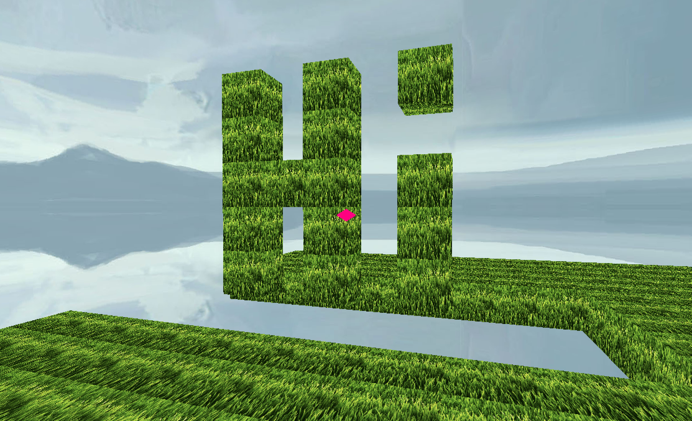
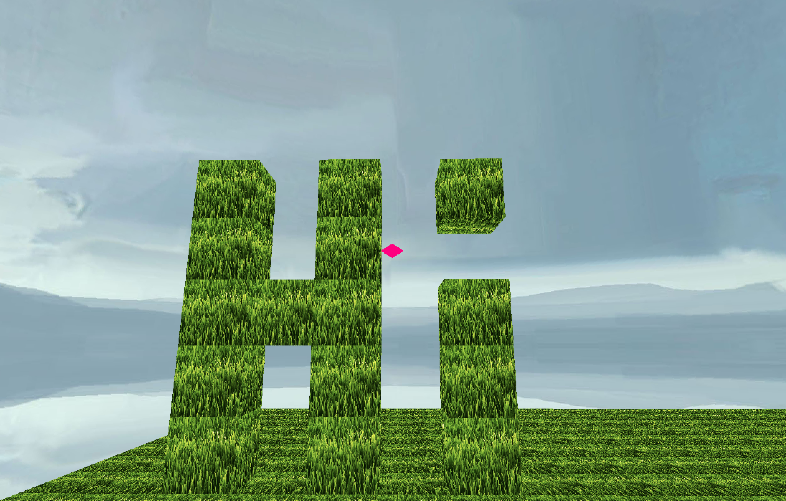
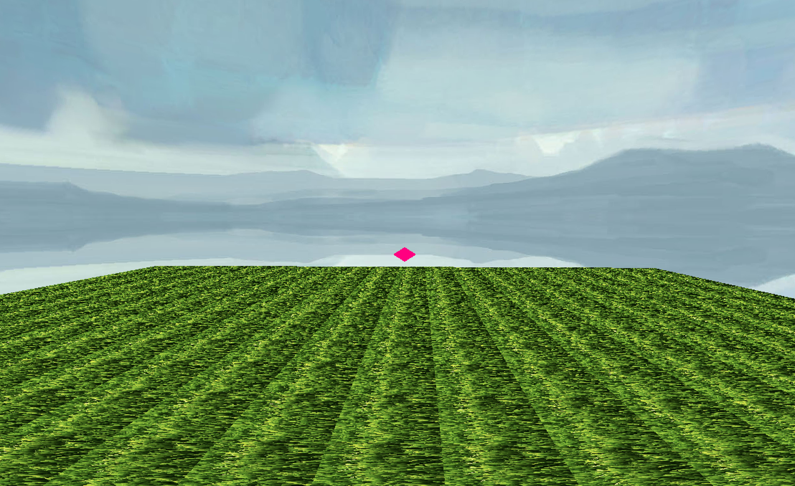

# 🟩 Minecraft-Demo

A lightweight Minecraft-style block-building demo built with the [Ursina Engine](https://www.ursinaengine.org/).  
This project features interactive block placement and removal in a first-person 3D world rendered using Panda3D.

## ✨ Features

- 🌱 **Procedural Ground Generation**: A 20x20 grid of grass-textured cubes creates the initial terrain.
- 🧱 **Block Placement**: Left-click on a cube to place another one in the direction you're pointing.
- ❌ **Block Destruction**: Right-click on a cube to remove it.
- 🎮 **First-Person Controller**: Move with WASD, look around with the mouse.
- 💡 **Visual Feedback**: Cubes darken slightly on hover and press for interaction clarity.
- 🖼️ **Texturing**: Cubes use a `grass.png` texture applied dynamically to all blocks.

## Requirements

- Python 3.7 or higher
- [Ursina](https://pypi.org/project/ursina/)
- [Panda3D](https://www.panda3d.org/)


## Installation

1. Clone or download the repository.
```bash
git clone https://github.com/Adil-Bikiev/Minecraft-Demo.git
``` 

2. Install dependencies:
```bash
pip install -r requirements.txt
```

3. Run the app:
```bash
python main.py
```

## Screenshots




## 🎮 Controls

| Key / Mouse        | Action              |
| ------------------ | ------------------- |
| `W`, `A`, `S`, `D` | Move the player     |
| Mouse Move         | Look around         |
| Left Mouse Click   | Place a new cube    |
| Right Mouse Click  | Remove hovered cube |

## Notes

* Make sure `grass.png` is in the same directory as your script.
* The project uses OpenGL 2.1 via Panda3D for compatibility.

## 🧾 License

This project is licensed under the [MIT License](LICENSE).
You are free to use, modify, and distribute this software as you like.


